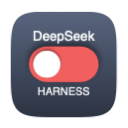
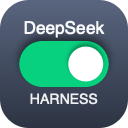
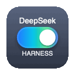
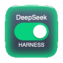
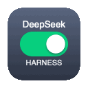
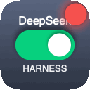
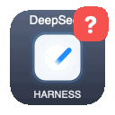
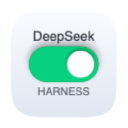

# DeepSeek Harness Switch (always-on Dock toggle app)

[简体中文](README.md) | **English**

**English**: An always-on Dock toggle for DeepSeek Harness — left-click to open or start the dsh web UI, right-click for the menu (stop service, animation toggle). The icon mirrors live service/task state and glows when a task finishes or needs confirmation.

**中文**：常驻程序坞的 DeepSeek Harness 开关 —— 左键点击回到/启动 dsh 网页界面，右键打开菜单（停止服务、动画开关）；图标实时显示服务与任务状态，并在任务完成或需要确认时发光提醒。

> Repository: https://github.com/wjingshan/dsh-dock-launcher
>
> **[⬇️ Download the latest release](https://github.com/wjingshan/dsh-dock-launcher/releases/latest)** — unzip and drag the app into `/Applications`.

A small **always-on** macOS app (Apple Silicon / M4) whose Dock icon is a **toggle switch**.
**Left-click** the Dock icon = start / return to the DeepSeek Harness (`dsh`) web UI; **right-click** = action menu (stop service, animation toggle, …).
The icon always reflects service & task state, and animates when a task **finishes**, **needs your confirmation**, or is **waiting for your choice**.

The UI language **follows the system**, with built-in **English / 简体中文 / 日本語 / 한국어** (you can also set it per-app in System Settings → General → Language & Region → Applications).

| Off | Running · Idle | Task running | Task done | Needs confirmation | Waiting · single choice | Waiting · multi-select |
|:--:|:--:|:--:|:--:|:--:|:--:|:--:|
|  |  |  |  |  |  |  |
| Red · knob left | Green · knob right | Multi-color aurora flow | Inward edge glow + white streamer (green) | Question-mark morph | Question-mark morph | Check-mark fade-overlap |

> Four of the cells above are **animations**. When dsh stops for an option prompt (`ask_user_question`) or plan approval (`exit_plan_mode`), **DeepSeek and HARNESS move apart, the switch's white knob grows into a large rounded square, and a blue symbol appears inside it**. It then keeps looping **until you actually make your choice in the dsh page and dsh continues**, at which point a **reverse animation** folds it back into the switch:
> - **Single choice / plain question**: a blue **question mark**, looping a soft brightness breath.
> - **Multi-select**: a blue **check mark**, looping a fade-overlap - it is drawn from the start, then dissolves from the start, and a new stroke begins while the old one is still fading out (two strokes overlap in time).
> - **Needs confirmation** (approvals) plays the same question-mark animation; they differ only in alert sound and notification text.

The icon uses a **squircle (continuous-corner)** shape and swaps its plate colors automatically for light/dark system appearance:

| Dark appearance (default) | Light appearance |
|:--:|:--:|
|  |  |

## ⚠️ Requirements (this is usually why it "does not work" on another Mac)

This app is a **companion toggle for DeepSeek Harness (`dsh`)** — not a standalone product:

1. **DeepSeek Harness must be installed**, the `dsh` command must work, and you should have run `dsh web` at least once. Otherwise clicking the icon reports "dsh not found".
2. **`DEEPSEEK_API_KEY`** must be available — `export DEEPSEEK_API_KEY=...` in `~/.zshrc`, or save it on the dsh Models page. Otherwise dsh reports `no API key`.
3. **(Optional) `brew install zstd`** — required for task-state monitoring and alerts. Without it the app can still start/stop the service, but the icon will not reflect task state.
4. **System**: macOS 14+, Apple Silicon or Intel (universal binary).
5. **First launch**: this app is not signed with a paid Developer ID and is not notarized. If macOS says the developer cannot be verified (or "is damaged"), **right-click the app → Open**, or run:
   ```sh
   xattr -dr com.apple.quarantine "/Applications/DeepSeek Harness 开关.app"
   ```
   The one-line installer below does this automatically.

The app menu also has an **"Environment Check…"** item showing the live status of all of the above with fix hints.

## One-line install

Run this in Terminal — it downloads the latest release and installs it to `/Applications` (removes the quarantine flag and launches it):

```sh
sh -c "$(curl -fsSL https://raw.githubusercontent.com/wjingshan/dsh-dock-launcher/main/install.sh)"
```

Manual install: download the `.dmg` (drag the app into Applications) or `.zip` (unzip and drag) from **[Releases](https://github.com/wjingshan/dsh-dock-launcher/releases/latest)**.

> If macOS says the developer cannot be verified: **right-click the app → Open** (or System Settings → Privacy & Security → Open Anyway).

## Artifact

```
DeepSeek Harness 开关.app   (current version v0.15.0)
```

## Features

- **Left-click the Dock icon = return to the page**: focuses an already-open `127.0.0.1:3080` tab; opens a new tab if the page was closed; starts the service if it is not running. It opens the **full tokenized URL**, so you never land on a 401 page: the runtime file written by the dock-bridge plugin is preferred, with the dsh startup log as the fallback when that plugin is not installed.
- **Right-click the Dock icon = action menu**: open page / got it (stop reminding) / **Stop service… (with confirmation)** / **animation toggle** / open log / quit.
- **Four icon states**:
  - `Off` (red, knob left) — service stopped
  - `Running · Idle` (green, knob right)
  - `Task running` — multi-color aurora flow (blue → cyan → green → violet long gradient drifting slowly + a soft light sweep, 60 fps)
  - `Needs attention` — **you are needed** (confirmation or a pending choice) = the morph animation (question mark / check mark, see below); **task done** = green inward edge glow + a 2 px white streamer along the edge
- **Dynamic alerts**: confirmation and **waiting for your choice** play a **morph animation** (0.9 s morph → looping once settled → a 0.42 s reverse animation folding back into the switch), together with a bounce, a notification and a sound - a blue **question mark** for single choice / plain questions (brightness breathing), a blue **check mark** for multi-select (fade-overlap: drawn, then dissolved from the start, rewritten while the tail is still fading); task completion still uses the green edge glow. Clicking the icon, choosing “Got it”, or moving the pointer onto the Dock also folds it back immediately.
- **Configurable alert sounds** (right-click menu → “Sound Settings…” opens a **dedicated window**): one aligned row per alert — confirmation / choice / task done / service started / service stopped — each with a sound popup (system sounds + `~/Library/Sounds`) and a preview button; the three reminders also get a **repeat count**: `1` / `2` / `3` / `5`, or **“until the pointer reaches the Dock”** (stops the moment the pointer enters the Dock or menu bar area — no Accessibility permission needed). The bottom row holds a “preview when selecting a sound” switch and “Restore Defaults”; settings persist.
- **About**: the right-click menu's “About …” shows the app name, version (with build number), the GitHub URL and the sponsor link, each openable from a button in the dialog.
- **Animation master switch**: turn all icon animations off/on from the right-click menu (static icons remain; bouncing and notifications still work). Cost is negligible — it only redraws a 128 px icon while animating.
- **Automatic API-key injection**: GUI-launched processes do not read `.zshrc`, so the app parses `DEEPSEEK_API_KEY` from `~/.zshenv` / `.zprofile` / `.zshrc` / `.bash_profile` / `.bashrc` / `.profile` and injects it into the `dsh` child process (read-only, never written to disk, never sent anywhere).
- **Task-state monitoring** by reading `~/.dsh/sessions/*/session.jsonl.zstd`:
  - `approval/request`, `approval/asked` → **needs confirmation**
  - `turn/end` (a normal conversation turn ended) → **task done**; if the session has an active goal, turn end is ignored and only `goal/change` (`operation == "complete"` / `goal.phase == "complete"`) counts as done
  - `turn/start` → **running**
  - `tool/call` whose tool is `ask_user_question` / `exit_plan_mode` → **waiting for your choice** (neither interaction has a dedicated event in the log, so they are identified by tool name)

> Completion rule: without an active goal, one finished turn counts as “done”; with an active goal, only the real goal completion notifies you. All recently active sessions are monitored, so parallel sessions are not missed.

## Relation to similar plugins

Several desktop launchers and notifiers already exist for dsh. The difference here is the **form factor**: this is not a dsh plugin but a standalone native macOS Dock app — with dsh not running at all, it still sits in the Dock and a left-click brings the service up and opens the page.

Related projects in the ecosystem (names and descriptions can be checked against the [awesome-dsh-plugin list](https://github.com/awesome-dsh-plugin/awesome-dsh-plugin)):

| Related project | Form factor | Difference from this app |
| --- | --- | --- |
| `dsh-start` | macOS, CLI + script that builds a Dock-able `DSH.app` | Same macOS start/stop surface, but CLI-first; you build the app yourself |
| `dsh-launcher` | macOS, menu-bar app + host plugin writing `runtime.json` | Entry point is a **menu-bar menu**; here the entry point is the **Dock icon** itself |
| `dsh-unread-dot` | macOS, Dock badge and chime | Uses the Web Badging API from inside dsh; this app is a native Dock app with its own icon animation |
| `dsh-task-watcher-plugin` | Windows, four-state tray icon + task panel | The four-state idea is close, but Windows-tray only and it runs a separate process |
| `dsh-tray`, `dsh-dock`, `dsh-native-launcher`, `dsh-desktop-windowos` | Windows tray / desktop shells | Different platform |
| `dsh-clean-desktop-shell` | Windows + macOS desktop shell | Shortcut- and tray-centric; the icon is not the status display |

No other project combines what this app does: **the Dock icon is both the status display and the only entry point** (left-click returns to the page, right-click opens the menu), a left-click starts the service when it is not running, the icon distinguishes `off / idle / running / attention` live, and completion is driven by the **real goal-end event** with a running count on the icon.

## Usage

1. Drag `DeepSeek Harness 开关.app` into `/Applications` and open it (optionally keep it in the Dock).
2. On launch the app **only reflects the real service state** (red “Off” if dsh is not running) — it does **not** auto-start dsh.
3. **Left-click** the Dock icon = start the service and open the dsh page (or return to it if already running).
4. **Right-click** the Dock icon = action menu (stopping the service always asks for confirmation).
5. Clicking the menu-bar icon opens the same menu.

> Allow notification permission on first run to receive “needs confirmation / task done” notifications.

## Optional: the dock-bridge host plugin

This repository also ships a small dsh host plugin, `plugins/dsh-dock-bridge`. With it
installed, the app no longer has to parse dsh's startup log: the dsh process **publishes
the port, PID and tokenized URL directly**.

```sh
# install from a local checkout (point the path at your clone)
dsh plugin --profile web add /path/to/dsh-dock-launcher/plugins/dsh-dock-bridge
```

Restart the web profile once afterwards. Notes:

- The plugin writes `~/.config/dsh-dock-launcher/runtime.json` (mode `0600`, because the
  file holds a live token) and deletes it on shutdown — including the SIGTERM path.
- The app trusts that file only while the reported PID is alive **and** the port still
  accepts connections; a crash leftover is ignored and the log fallback takes over.
- **The app works fine without the plugin**: the fallback parses the tokenized URL out of
  `~/Library/Logs/dsh-web.log`.
- The “Environment check…” menu item shows which path is in use.

> The plugin is also this repository's entry for
> [awesome-dsh-plugin](https://github.com/awesome-dsh-plugin/awesome-dsh-plugin), which
> requires a host plugin installable via `dsh plugin add` rather than a plain `.app`.

## Versioning

- Semantic versioning starting at **0.1.0**: `patch` (+0.0.1) for fixes, `minor` (+0.1.0) for features/behavior changes (during 0.x), `major` (+1.0.0) once stable.
- `VERSION` holds the semantic version; `BUILD_NO` is the auto-incrementing build number (gitignored).
- Every change is recorded in `CHANGELOG.md`.

## Build

```sh
cd dsh-dock-launcher
./build.sh     # icons → icns → compile → assemble → bundle localizations → sign (injects version)
```

- Icons & animation: `src/Icons.swift`; app icon: `src/draw_icon.swift`.
- Service / monitoring / alerts: `src/ServiceManager.swift`, `src/TaskMonitor.swift`, `src/main.swift`.
- UI strings: `resources/*.lproj/Localizable.strings` (en / zh-Hans / ja / ko).

## Layout

```
dsh-dock-launcher/
├── src/                    # Swift sources (app, service, monitor, icons, icon drawing)
├── resources/              # Localizable.strings for en / zh-Hans / ja / ko
├── docs/                   # icon previews + Alipay QR (used by README)
├── plugins/dsh-dock-bridge/    # optional host plugin: port/PID/tokenized URL (dsh plugin add)
├── install.sh              # one-line installer for /Applications
├── Info.plist              # bundle metadata (incl. CFBundleLocalizations)
├── build.sh / VERSION / BUILD_NO / CHANGELOG.md
├── LICENSE                 # MIT
├── README.md / README.en.md
└── DeepSeek Harness 开关.app   # built artifact (gitignored)
```

## License

[MIT](LICENSE) © 2026 wjingshan

---

## ☕ Sponsor

`DeepSeek Harness Switch` is a small tool I built for myself and open-sourced. If it helps you, you are welcome to buy me a coffee ☕


<div align="center">

**Thank you for your support!** 💙

</div>
