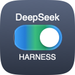
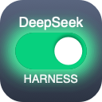
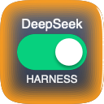

# DeepSeek Harness Switch (always-on Dock toggle app)

[简体中文](README.md) | **English**

**English**: An always-on Dock toggle for DeepSeek Harness — left-click to open or start the dsh web UI, right-click for the menu (stop service, animation toggle). The icon mirrors live service/task state and glows when a task finishes or needs confirmation.

**中文**：常驻程序坞的 DeepSeek Harness 开关 —— 左键点击回到/启动 dsh 网页界面，右键打开菜单（停止服务、动画开关）；图标实时显示服务与任务状态，并在任务完成或需要确认时发光提醒。

> Repository: https://github.com/wjingshan/dsh-dock-launcher
>
> **[⬇️ Download the latest release](https://github.com/wjingshan/dsh-dock-launcher/releases/latest)** — unzip and drag the app into `/Applications`.

A small **always-on** macOS app (Apple Silicon / M4) whose Dock icon is a **toggle switch**.
**Left-click** the Dock icon = start / return to the DeepSeek Harness (`dsh`) web UI; **right-click** = action menu (stop service, animation toggle, …).
The icon always reflects service & task state, and animates when a task **finishes** or **needs your confirmation**.

The UI language **follows the system**, with built-in **English / 简体中文 / 日本語 / 한국어** (you can also set it per-app in System Settings → General → Language & Region → Applications).

| Off | Running · Idle | Task running | Task done | Needs confirmation |
|:--:|:--:|:--:|:--:|:--:|
|  |  |  |  |  |
| Red · knob left | Green · knob right | Multi-color aurora flow | Inward edge glow + white streamer | Inward edge glow + white streamer |

The icon uses a **squircle (continuous-corner)** shape and swaps its plate colors automatically for light/dark system appearance:

| Dark appearance (default) | Light appearance |
|:--:|:--:|
|  |  |

## One-line install

Run this in Terminal — it downloads the latest release and installs it to `/Applications` (removes the quarantine flag and launches it):

```sh
sh -c "$(curl -fsSL https://raw.githubusercontent.com/wjingshan/dsh-dock-launcher/main/install.sh)"
```

Manual install: download the `.dmg` (drag the app into Applications) or `.zip` (unzip and drag) from **[Releases](https://github.com/wjingshan/dsh-dock-launcher/releases/latest)**.

> If macOS says the developer cannot be verified: **right-click the app → Open** (or System Settings → Privacy & Security → Open Anyway).

## Artifact

```
DeepSeek Harness 开关.app   (current version v0.13.0)
```

## Features

- **Left-click the Dock icon = return to the page**: focuses an already-open `127.0.0.1:3080` tab; opens a new tab if the page was closed; starts the service if it is not running.
- **Right-click the Dock icon = action menu**: open page / got it (stop reminding) / **Stop service… (with confirmation)** / **animation toggle** / open log / quit.
- **Four icon states**:
  - `Off` (red, knob left) — service stopped
  - `Running · Idle` (green, knob right)
  - `Task running` — multi-color aurora flow (blue → cyan → green → violet long gradient drifting slowly + a soft light sweep, 60 fps)
  - `Needs attention` — inward glow from the icon edge + a 2 px white streamer travelling along the edge; green = done, orange = confirmation needed
- **Dynamic alerts**: when a task finishes or needs confirmation *and* you are not on the dsh page, the icon bounces 4 times with a notification and a sound, then settles into a **quiet continuous glow**; it stops as soon as you **return to the dsh page**, click the icon, or choose “Got it” (no periodic bouncing).
- **Animation master switch**: turn all icon animations off/on from the right-click menu (static icons remain; bouncing and notifications still work). Cost is negligible — it only redraws a 128 px icon while animating.
- **Automatic API-key injection**: GUI-launched processes do not read `.zshrc`, so the app parses `DEEPSEEK_API_KEY` from `~/.zshenv` / `.zprofile` / `.zshrc` / `.bash_profile` / `.bashrc` / `.profile` and injects it into the `dsh` child process (read-only, never written to disk, never sent anywhere).
- **Task-state monitoring** by reading `~/.dsh/sessions/*/session.jsonl.zstd`:
  - `approval/request`, `approval/asked` → **needs confirmation**
  - `turn/end` (a normal conversation turn ended) → **task done**; if the session has an active goal, turn end is ignored and only `goal/change` (`operation == "complete"` / `goal.phase == "complete"`) counts as done
  - `turn/start` → **running**

> Completion rule: without an active goal, one finished turn counts as “done”; with an active goal, only the real goal completion notifies you. All recently active sessions are monitored, so parallel sessions are not missed.

## Usage

1. Drag `DeepSeek Harness 开关.app` into `/Applications` and open it (optionally keep it in the Dock).
2. On launch the app **only reflects the real service state** (red “Off” if dsh is not running) — it does **not** auto-start dsh.
3. **Left-click** the Dock icon = start the service and open the dsh page (or return to it if already running).
4. **Right-click** the Dock icon = action menu (stopping the service always asks for confirmation).
5. Clicking the menu-bar icon opens the same menu.

> Allow notification permission on first run to receive “needs confirmation / task done” notifications.

## Versioning

- Semantic versioning starting at **0.1.0**: `patch` (+0.0.1) for fixes, `minor` (+0.1.0) for features/behavior changes (during 0.x), `major` (+1.0.0) once stable.
- `VERSION` holds the semantic version; `BUILD_NO` is the auto-incrementing build number (gitignored).
- Every change is recorded in `CHANGELOG.md`.

## Build

```sh
cd dsh-dock-launcher
./build.sh     # icons → icns → compile → assemble → bundle localizations → sign (injects version)
```

- Icons & animation: `src/Icons.swift`; app icon: `src/draw_icon.swift`.
- Service / monitoring / alerts: `src/ServiceManager.swift`, `src/TaskMonitor.swift`, `src/main.swift`.
- UI strings: `resources/*.lproj/Localizable.strings` (en / zh-Hans / ja / ko).

## Layout

```
dsh-dock-launcher/
├── src/                    # Swift sources (app, service, monitor, icons, icon drawing)
├── resources/              # Localizable.strings for en / zh-Hans / ja / ko
├── docs/                   # icon previews + Alipay QR (used by README)
├── install.sh              # one-line installer for /Applications
├── Info.plist              # bundle metadata (incl. CFBundleLocalizations)
├── build.sh / VERSION / BUILD_NO / CHANGELOG.md
├── LICENSE                 # MIT
├── README.md / README.en.md
└── DeepSeek Harness 开关.app   # built artifact (gitignored)
```

## License

[MIT](LICENSE) © 2026 wjingshan

---

## ☕ Sponsor

`DeepSeek Harness Switch` is a small tool I built for myself and open-sourced. If it helps you, you are welcome to buy me a coffee ☕


<div align="center">

**Thank you for your support!** 💙

</div>
